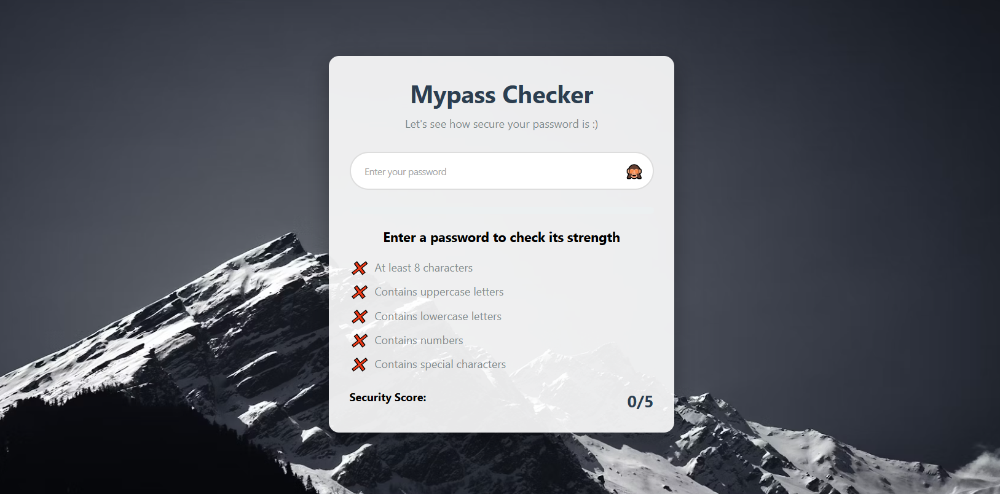

# Mypass Checker

A simple local tool to see how strong your password is. 
<br> <br>




## Features

- Visual strength meter with colors
- Checklist of password requirements
- Helpful improvement suggestions
- Show/hide password toggle
<br>

### Quick Start
1. Clone the repository:
   ```
   git clone https://github.com/yourusername/nasa-apod-streamlit.git
   streamlit run main.py
   ```
<br>

## Installation
No specific requirement needed.

<br>

## Countribute 🤝
Feel free to contribute
<br><br>


